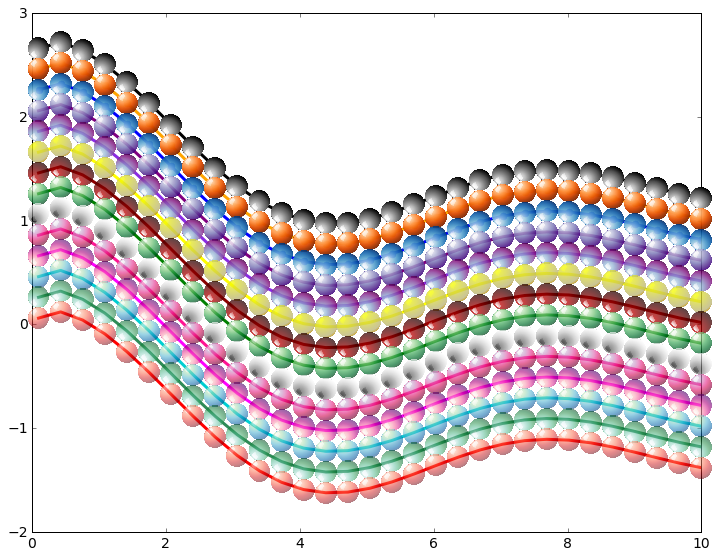
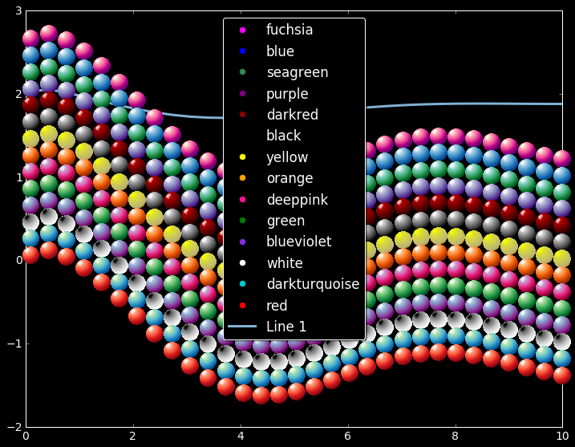

==============
 plot_esferas
==============

This is a short hack to use spheres as markers in matplotlib scatter plots in python. The approach may be extended to use any arbitrary image as a marker.
I mimicked some of the usual options of `plot()`.

The main idea was borrowed/taken/(your-choice-of-words) from:
http://matplotlib.1069221.n5.nabble.com/custom-markers-from-images-tp4166p4173.html

The "new" colormap for yellow spheres is from http://schubert.atmos.colostate.edu/~cslocum/custom_cmap.html

I put this together in a small function for  easy use, and added it as a method to matplotlib Axes. I am sharing it in case somebody else finds it useful.

I am sure that there are many better ways to obtain the same result, and I'll be **really** very glad to learn about them.

What does it do?
================

A picture is worth a thousand ...

and then two: 2000 ...

Changing the style looks nice too ...

           

How to use it?
==============

The use it is pretty simple. Just call the method: `ax.plot_esfera`

There are two scripts showing how to use it ``simple_example_1.py`` and ``simple_example_2.py``. They are something similar to this:

.. code:: python

  import numpy as np 
  import matplotlib.pyplot as plt
  import plt_esfera

  fig= plt.figure(figsize=(12,9))
  ax= fig.add_subplot(111, aspect='auto')

  x= np.linspace(0.1,10,31)
  y= 1.5*(1+ np.sin(x)/(.01+x))
  y1= y
  for c in plt_esfera.colores.keys():
    if len(c) > 1:
      y1 -= .2
      ax.plot_esfera( x,y1, color=c, markersize=14, label=c)
      
  # Plot a simple "standard" line
  ax.plot(x,2+(.5+x)*y/(1+x)**2,'-k',lw=3, label='Line 1')
  # 
  ax.legend(loc='best', numpoints=1)
  plt.show()
          
 
Does it need improving?
=======================

Yes, they are several unresolved issues. Foremost, it would be really nice to have the spheres appearing (atutomatically) in the legend when using labels. Currently a circle with a similar color will be shown.
